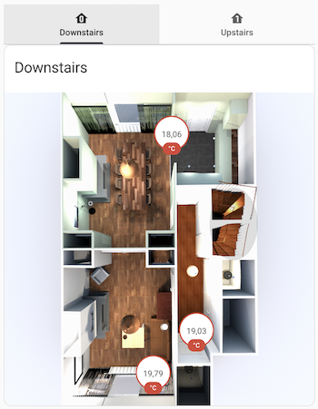
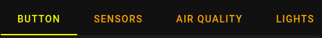
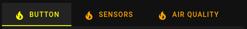
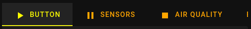

# Tabbed Card Programmable

A custom card for home assistant that utilizes tabs to segregate individual cards. Fork of [Tabbed Card](https://github.com/kinghat/tabbed-card) by kinghat.



## All changes from kinghat's version (forked from v0.3.1):

As the original dev kinghat did not respond to my pull request (https://github.com/kinghat/tabbed-card/pull/105) for a long time, I decided to fork and publish this as a separate card.

### v0.4.0 - 2025-05-25

Needed some features for my own use case, so I added them to this fork:

- Added support for hiding and disabling tabs using the `hide` and `disable` attributes. Both attributes support boolean values or Jinja templates that evaluate to boolean values.
- Added support for dynamic tab labels using Jinja templates
- Upgraded from deprecated `@material/mwc-tab-bar` and `@material/mwc-tab` to the newer `@material/web` package
- Removed support for `isFadingIndicator` and `isMinWidthIndicator` attributes (no longer supported by Material Web)

### v0.3.4 - 2023-10-24

- Added support for conditional default index of tabs using Jinja templates

## Installation

[](https://github.com/hacs/integration)

Use [HACS](https://hacs.xyz) or follow this [guide](https://github.com/thomasloven/hass-config/wiki/Lovelace-Plugins)

## Card Schema

```yaml
type: custom:tabbed-card-programmable
options?:
  defaultTabIndex?: number | string
styles?:
attributes?:
  label?: string
  icon?: string
  minWidth?: boolean
  stacked?: boolean
  hide?: boolean | string # New property
  disable?: boolean | string # New property
tabs:
  - card:
      type:
    styles?:
    attributes?:
      label?: string
      icon?: string
      minWidth?: boolean
      stacked?: boolean
```

### Example

```yaml
- type: custom:tabbed-card-programmable
  tabs:
    - card:
        type: button
        entity: light.bed_light
        tap_action:
          action: toggle
        show_name: true
        show_icon: true
        show_state: true
      attributes:
        label: Button
    - card:
        type: entities
        title: Air Quality
        entities:
          - air_quality.demo_air_quality_home
          - air_quality.demo_air_quality_office
      attributes:
        label: Air Quality
    - card:
        type: entities
        title: Binary sensor
        entities:
          - binary_sensor.basement_floor_wet
          - binary_sensor.movement_backyard
      attributes:
        label: Binary Sensor
    - card:
        type: entities
        title: Calendar
        entities:
          - entity: calendar.calendar_1
            name: "1"
          - entity: calendar.calendar_2
            name: "2"
      attributes:
        label: Calendar
```

## Configuration

You can apply global and per tab configuration to your card. Global configuration(top level properties) are expressed on all tabs in your card. You can also set local configuration, per tab styles and attributes that take precedence over any corresponding global configuration.

### **Options**

| Property          | Default | Description                                               |
| ----------------- | ------- | --------------------------------------------------------- |
| `defaultTabIndex` | `0`     | tab to display on first render (0 based, jinja supported) |

```yaml
type: custom:tabbed-card-programmable
options:
  defaultTabIndex: 1 # in a 0 based index, the second tab would be the active tab on render
tabs: ...
```

### **Styling**

This card tries to closely match home assistants default tab styles. You can override and apply additional styling to the card via provided material web components custom properties.

Default Custom Properties:

| Name                                             | Defaults (All from current HA-theme)       | Description                                 |
| ------------------------------------------------ | ------------------------------------------ | ------------------------------------------- |
| `--md-sys-color-primary`                         | 'var(--primary-text-color)'                | Color of the active tab's text color        |
| `--md-sys-color-on-surface-variant`              | 'rgba(var(--rgb-primary-text-color), 0.6)' | Color of the inactive tab's background.     |
| `--md-primary-tab-container-color`               | 'transparent'                              | Background color of the tab container.      |
| `--md-primary-tab-label-text-font`               | 'var(--app-font-family)'                   | Font family for tab labels.                 |
| `--md-primary-tab-active-indicator-color`        | 'var(--primary-text-color)'                | Color of the active tab indicator.          |
| `--md-primary-tab-icon-color`                    | 'rgba(var(--rgb-primary-text-color), 0.6)' | Color of the tab icon.                      |
| `--md-primary-tab-active-focus-icon-color`       | 'var(--primary-text-color)'                | Color of the active focused tab icon.       |
| `--md-primary-tab-active-focus-label-text-color` | 'var(--primary-text-color)'                | Color of the active focused tab label text. |
| `--md-primary-tab-label-text-size`               | 'var(--ha-font-size-m)'                    | Font size for tab labels.                   |

```yaml
type: custom:tabbed-card-programmable
styles: # global styles applied to all tabs
  --md-sys-color-primary: yellow
  --md-sys-color-on-surface-variant: orange
tabs: ...
```



See the full list of exposed custom properties: [`<md-tabs>` and `<md-primary-tab>`](https://material-web.dev/components/tabs/)

### **Attributes**

| Name       | Default | Description                                                     |
| ---------- | ------- | --------------------------------------------------------------- |
| `label`    | `""`    | Text label to display in tab. Supports Jinja templates.         |
| `icon`     | `""`    | Home Assistant `mdi:icon` name.                                 |
| `minWidth` | `false` | Shrinks tab as narrow as possible without causing text to wrap. |
| `stacked`  | `false` | Stacks icon on top of label text.                               |
| `hide`     | `false` | Completely removes the tab from the tab bar.                    |
| `disable`  | `false` | Shows the tab but makes it non-clickable (grayed out).          |

Global attributes:

```yaml
type: custom:tabbed-card-programmable
styles:
  ...
attributes:
  icon: mdi:fire # global attribute applied to all tabs
tabs:
  - attributes:
      label: Button
    card:
      type: button
      entity: light.bed_light
      tap_action:
        action: toggle
      show_name: true
      show_icon: true
      show_state: true
  ...
```



Local attributes:

```yaml
type: custom:tabbed-card-programmable
styles: ...
tabs:
  - attributes:
      label: Button # local attributes that apply only to individual tabs
      icon: mdi:play
    card:
      type: button
      entity: light.bed_light
      tap_action:
        action: toggle
      show_name: true
      show_icon: true
      show_state: true
  - attributes:
      label: Sensors
      icon: mdi:pause
    card:
      type: entities
      title: Sensor
      entities:
        - sensor.carbon_dioxide
        - sensor.carbon_monoxide
        - sensor.outside_humidity
        - sensor.outside_temperature
        - sensor.power_consumption
        - sensor.today_energy
  - attributes:
      label: Air Quality
      icon: mdi:stop
    card:
      type: entities
      title: Air Quality
      entities:
        - air_quality.demo_air_quality_home
        - air_quality.demo_air_quality_office
```



## Dynamic Tab Features

### Hide and Disable Tabs

You can hide or disable tabs using the `hide` and `disable` attributes. Both attributes support boolean values or Jinja templates that evaluate to boolean values.

### Dynamic Tab Labels

You can use Jinja templates in the `label` attribute to create dynamic tab labels that change based on conditions or entity states:

```yaml
type: custom:tabbed-card-programmable
tabs:
  - attributes:
      label: "Temperature: {{ states('sensor.temperature') }}°C"
    card:
      type: entities
      entities:
        - sensor.temperature
  - attributes:
      label: "Light ONLight OFF"
    card:
      type: entities
      entities:
        - light.living_room
```

### Using boolean values:

```yaml
type: custom:tabbed-card-programmable
tabs:
  - attributes:
      label: Always Visible
    card:
      type: entities
      entities:
        - light.living_room
  - attributes:
      label: Hidden Tab
      hide: true
    card:
      type: entities
      entities:
        - light.bedroom
  - attributes:
      label: Disabled Tab
      disable: true
    card:
      type: entities
      entities:
        - light.kitchen
```

### Using Jinja templates:

```yaml
type: custom:tabbed-card-programmable
tabs:
  - attributes:
      label: Always Visible
    card:
      type: entities
      entities:
        - light.living_room
  - attributes:
      label: Hidden at Night
      hide: "truefalse"
    card:
      type: entities
      entities:
        - light.bedroom
  - attributes:
      label: Disabled when Off
      disable: "truefalse"
    card:
      type: entities
      entities:
        - light.kitchen
```

## Appreciation

Thanks to kinghat for the original [Tabbed Card](https://github.com/kinghat/tabbed-card)
